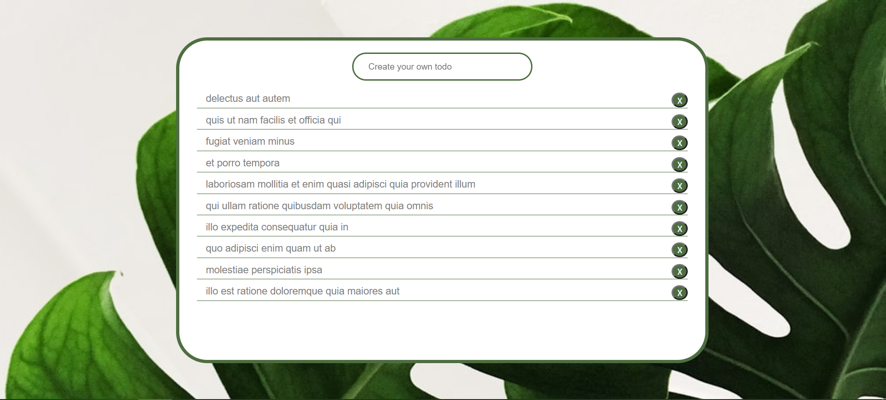

# to_do_list


## Особенности
Приложение реализовано с использованием `vue-cli`, данные подтягиваются с фейк-API, затем рендерятся в компоненте на сайт, функционал сайта заключается в добавлении задач в список или в удалении задачи, нажатием специальной кнопки. 

## Настройка проекта
```
npm install
```

### Запуск в режиме разработки 
```
npm run serve
```
В консоли появится ссылка на `localhost`, где будет доступен сайт.

### Настройка персональной конфигурации
Смотрите [Configuration Reference](https://cli.vuejs.org/config/).
